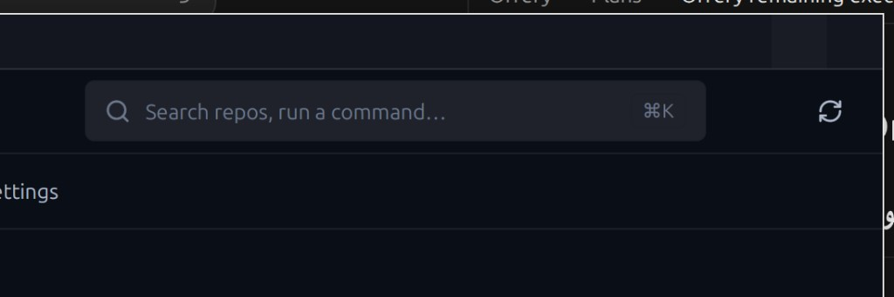

# Changelog

All notable changes to [RepoHarbor](https://github.com/azmykn/RepoHarbor) by DigitsCode are documented here.

The format follows [Keep a Changelog](https://keepachangelog.com/en/1.1.0/),
and this project (upstream) uses calendar versioning (`YYYY.M.P`).

## [Unreleased]

DigitsCode RepoHarbor — multi-repo workspaces (hundreds of checkouts across
versioned trees, including nested submodule parents).

### Changed

- **Mission Control work modes** — toolbar segmented control **Needs me |
  Behind | Working | All** replaces the dense chip strip. Needs me shows the
  attention count; Working offers Dirty / Stageable / Pushable only; All offers
  Public / Private / Starred / Stale. **Fetch all** / **Summarize** move under
  **More ⋮**; **Actions** appears only with a selection; sort labels are
  **Sort: recent** / **Sort: name** (heatmap stays hidden).
- **Brand icon** — new harbor + repo-stack mark (SVG + packaging PNGs + tray
  glyphs); default accent aligned to harbor teal `#1dd3c4`.
- **Docs shots** — removed Orrery-branded screenshots from `docs/public/shots/`
  and unlinked them from the guide (re-capture pending from the native app).

### Added

- **Submodule discovery** — after scanning top-level checkouts, parse each
  parent’s `.gitmodules` and register checked-out submodules with `parent_id` /
  `submodule_path` (no deep WalkDir into every repo).
- **TREE sidebar** — expandable parent → submodule children under GROUPS;
  click parent to focus Mission Control on parent + children; children hidden
  from the flat grid by default (avoids duplicating shared modules × N).
- **Submodule Update** — Actions / context menu discovers children and
  fast-forward-pulls each on its configured (or current) branch; the fleet toast
  detail lists per-path outcomes (`path: pulled` / `skipped` / error).
- **Action filters** — Mission Control chips **Stageable** (`unstaged > 0`),
  **Commitable** (`dirty > 0`), **Pushable** (`ahead > 0`), with counts; TREE
  keeps a parent visible when a child matches the active filter.
- **Context menus** — right-click on repo cards, Mission Control **list** rows,
  and TREE rows: Open drawer, Stage all, Commit All…, Generate & commit
  (shown only when `aiReady`), Push, Fetch, Pull, Update submodules.
- **Actions ⚙** — toolbar gear dropdown for fleet Stage / Commit / Push /
  Fetch / Pull / Discard / Reset / Submodule Update / Prune on the selection.
- **Fleet Discard** — discard working-tree changes (with confirm) across the
  selection; keeps commits.
- **Pull behind** — toolbar / palette action fleet-pulls every repo with
  `behind > 0` (upstream checkouts stay current without hunting chips).
- **Pull-only prefixes** — Settings editor for upstream path prefixes: Pull to
  update, hide Push, and **silence** upstream CI on Attention chips (no demoted
  UpstreamCi noise); digits modules outside the list stay Pushable. Push
  attempts on pull-only trees toast an error instead.
- **Activity Log** — top-nav **Log** view: in-memory ring of recent scans,
  toasts, fleet push/pull/fetch outcomes, and soft CI refresh notices (home
  directory redacted to `~` in Log lines).
- **Docs privacy** — publish notes for keeping local config/cache out of git and
  avoiding client paths in screenshots ([Privacy](docs/guide/privacy.md)).
- **Attention chips** — Mission Control cards/list show top reason badges plus a
  suggested-action subtitle; **Merge conflict** is Urgent; empty Attention filter
  shows **All clear**.
- **External diff** — Changes drawer **Open external diff** runs
  `diff_command` (`{path}` / `{file}`; default detects `meld` / `code` /
  `xdg-open`).
- **Terminal launcher** — open a configured terminal / agent command at the repo.
- **AI commit** — Generate & commit (fleet + drawer) when `aiReady`; Settings
  notes restarting Ollama and preferring `qwen2.5:3b`+.
- **Fleet shortcuts** — <kbd>Ctrl/Cmd+Shift+F</kbd> Fetch selected,
  <kbd>Ctrl/Cmd+Shift+P</kbd> Pull selected.
- **Fleet ops** — `FleetOp::StageAll`, `Push`, `Fetch`, `Pull`, `Discard`,
  `SubmoduleUpdate`, and related multi-select bar actions.
- **Smart “+” add flow** — header **+** opens one modal with tabs: Add local
  path (single repo **or** scan folder), Clone from GitHub, New repository
  (shared `prepare_workspace_root` with Settings).
- **Commit All / Generate** in the Changes drawer from the full working tree
  (not staged-only), with clearer AI error toasts.
- **Top navigation tabs** — primary views (Mission Control, Inbox, Feed, …)
  moved to a horizontal tab bar under the header; left rail is context-only
  (GROUPS / TREE / ROOTS / LANGUAGES).
- **gpui-component icon assets** — register `gpui-component-assets` alongside
  RepoHarbor’s lucide pack so TitleBar window controls and Button icons render.

### Changed

- **Header chrome contrast** — `+` is a single secondary (solid) chip (no
  dropdown; tabs live in the add modal); sidebar toggle and rescan sit on
  visible button backgrounds; TitleBar uses a lifted surface and bright
  foreground so minimize / maximize / close stay readable.
- **Deleted-file detection** — deeper watcher + status refresh so removals show
  reliably in Changes.
- **Repo name filter** — Mission Control toolbar query (`grid.query`) filters by
  name / slug / path.
- **Workspace groups** — GROUPS section with Fetch / Pull on the active group.
- **CI 403** — soft Info toast (not sticky Error); when the hint mentions org
  SSO, the toast links to Authorize SSO / the OAuth app settings page.

### Fixed

- Invisible **minimize / maximize / close** and header **+** when only RepoHarbor
  lucide assets were registered (gpui-component `IconName` paths never loaded).
- Single-repo add path (e.g. `/home/user/Projects/RepoHarbor`) without requiring a parent of
  many repos.

### Screenshots

Pre-rebrand UI shots that showed the old product name in chrome were removed.
Re-capture from the native RepoHarbor app before linking images here again.

| Surface | Shot |
|---------|------|
| Header: **+** chip + window controls |  |
| Header before contrast fix (reference) |  |

> When re-capturing shots, keep private repos and machine-specific home paths out
> of published images (use generic `~/dev/…` layouts).

---

## Attribution

Includes software originally published as Orrery by Seb Burrell (MIT).
This is an independent DigitsCode product, not an official fork continuation.
See [NOTICE](NOTICE).
