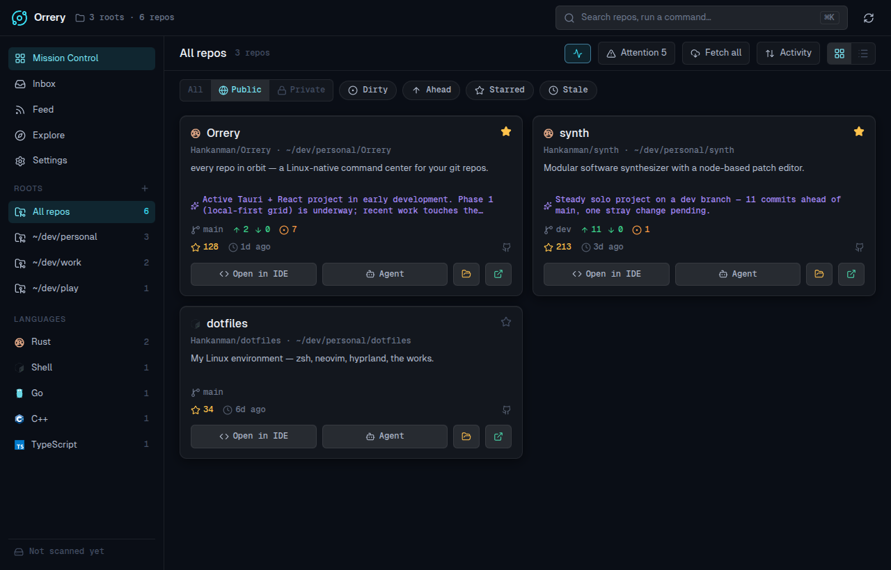
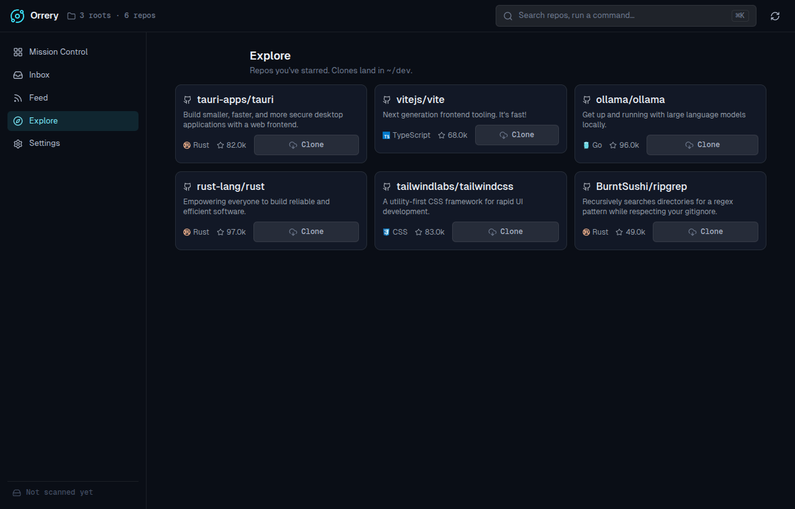
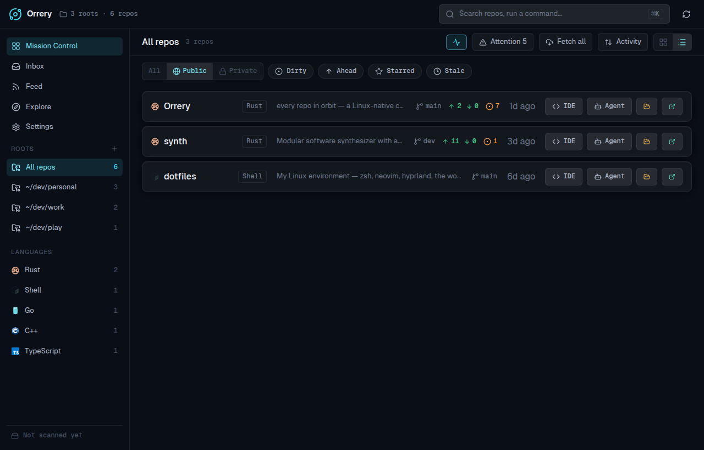

<div align="center">


# RepoHarbor

**every repo at harbor**

A Linux-native command center for your git fleet — live git status at a glance, one-click launch into your IDE or a terminal coding agent, enriched with multi-host data and local-AI summaries.

📖 **[Documentation & feature tour →](https://azmykn.github.io/RepoHarbor/)** · 📋 **[Changelog](CHANGELOG.md)** · ©️ **[Copyright & contact](COPYRIGHT.md)**



</div>

---

> **Credit:** Includes software originally published as Orrery by Seb Burrell (MIT). Independent DigitsCode product — not an official fork continuation.

> **Status:** 🚧 Early development, but functional. Now a **native Rust app on GPUI** (no webview) — the earlier Tauri 2 + React build was rewritten for GPU rendering. Mission Control, multi-host enrichment, launchers, Inbox/Feed/Explore/Cleanup/Agents/Dev Tools, and local AI all work. Tagged releases produce `.deb`/`.rpm`/`.AppImage`; you can also [build from source](https://azmykn.github.io/RepoHarbor/guide/getting-started). Expect rough edges; track progress in [the issues](../../issues).

## What’s new (DigitsCode)

RepoHarbor targets large multi-repo workspaces (hundreds of repos, nested
submodules). Highlights:

| | |
|---|---|
| **Submodule TREE** | Sidebar tree of parents → checked-out submodules; grid hides children by default |
| **Submodule Update** | Discover + pull each child on its branch; toast lists per-path results |
| **Actions ▾ / Discard** | Fleet Stage, Commit, Push, Fetch, Pull, Discard, Reset — Actions only when selected |
| **Pull behind** | One action pulls every repo that is behind upstream |
| **Pull-only paths** | Settings prefixes for upstream trees (Pull, no Push; upstream CI demoted) |
| **Needs me mode** | Attention count on the mode segment; reason badges + suggested actions; empty → All clear |
| **External diff** | Changes drawer opens `meld` / configured `diff_command` |
| **Terminal + AI commit** | Terminal/agent launcher; Generate & commit when `aiReady` |
| **Working chips** | Dirty / Stageable / Pushable under Working mode + right-click on cards **and list** rows |
| **Smart +** | One dark **+** chip → tabbed modal: Add local path / Clone from GitHub / New repository |
| **Top tabs** | Primary nav as horizontal tabs; sidebar stays GROUPS / TREE / ROOTS / … |
| **Readable chrome** | Window min/max/close and header **+** load gpui-component icons with clearer contrast |

Full notes: **[CHANGELOG.md](CHANGELOG.md)**.

<p align="center">
  
  &nbsp;
  
</p>

<p align="center">
  
  &nbsp;
  
</p>

## What is it?

Point RepoHarbor at the directories where you keep your projects. It discovers every git repo inside them and lays them out in a dark, dense "mission control" grid. Each card fuses three sources of truth:

1. **Local git** — branch, ahead/behind, uncommitted changes, last commit, detected language
2. **Your git host** *(GitHub & GitLab, incl. self-hosted)* — stars, topics, releases, issues, visibility
3. **Local AI** — a synthesized "what is this / what's been happening" blurb, generated on-device

…and every card is a launchpad: one click to open the repo in your IDE, or to drop a terminal coding agent (Claude Code, Aider, Codex, …) straight into it.

## Features

- **Mission Control** — a virtualized grid that scales to hundreds of repos, with **work modes** (Needs me / Behind / Working / All), contextual chips, workspace root / language / name search, Sort: recent|name, and a <kbd>⌘K</kbd> command palette.
- **Submodule TREE** — parents expand to checked-out submodule children; focusing a parent scopes the grid to that family (children stay out of the flat grid otherwise).
- **Context menus & fleet** — right-click on grid cards or list rows for Stage all, Commit All / Generate & commit (`aiReady`), Push, Fetch, Pull; multi-select fleet Stage all / Push.
- **One-click launchers** — open in your IDE or drop a terminal agent into any repo. Pick your tools from preset chips with real brand logos (VS Code, Cursor, Zed, the JetBrains family, …; Kitty/Alacritty/Ghostty/… × Claude Code/Aider/Codex/…). The card buttons show whatever you configured.
- **Repo drawer** — branches, recent commits, Changes with **Commit All** / AI generate from the working tree, staged hunks, and the README.
- **Inbox / Feed / Explore** — what needs you (PRs, reviews, issues, notifications), a release/social activity feed, and a browser for your starred repos with one-click clone.
- **Local AI** — repo summaries, commit messages, a daily briefing, and semantic search, all on-device via [Ollama](https://ollama.com). Turn it off and every AI affordance disappears.
- **Native desktop integration** — borrows the system theme, accent colour, and window decorations so it feels at home on KDE/GNOME.
- **Offline-first** — a local SQLite cache paints the grid instantly on launch and keeps working without a connection; visibility and host enrichment survive restarts.

See the [feature tour](https://azmykn.github.io/RepoHarbor/guide/mission-control) for more screenshots of each surface.

## Why?

There's no great *workspace dashboard* for Linux. GitKraken is heavy and git-focused; GitHub Desktop has no Linux build and is single-repo. RepoHarbor is the at-a-glance morning view of everything you're working on — and the fastest way to jump back in.

## Stack

| Layer | Choice |
|---|---|
| UI | Native Rust on [GPUI](https://www.gpui.rs) (Zed's GPU UI framework) — no webview |
| Rendering | GPU via `blade` (Vulkan), Wayland/X11 direct; [gpui-component](https://github.com/longbridge/gpui-component) widgets + [gpui-component-assets](https://github.com/longbridge/gpui-component) icons |
| Git | `git2` (libgit2, vendored) |
| Persistence | SQLite (`rusqlite`, bundled) + TOML config (XDG dirs) |
| Hosts | GitHub + GitLab REST/GraphQL via `reqwest` (rustls), incl. self-hosted |
| Local AI | [Ollama](https://ollama.com) / bundled [llama.cpp](https://github.com/ggml-org/llama.cpp) — summaries, commit messages, embeddings |
| Desktop | `zbus` (D-Bus theme/accent), `ksni` tray, global shortcut, notifications |

It's a three-crate Cargo workspace: `repoharbor-core` (logic), `repoharbor-platform`
(Linux desktop integration), `repoharbor` (the GPUI app + binary).

## Building

Prerequisites: a recent **Rust** toolchain and the GPUI system libraries (Vulkan
loader + headers, Wayland, `libxkbcommon`, `libxcb`, `fontconfig`, plus a C/C++
toolchain, `cmake`, and `pkg-config`). `bash scripts/setup.sh` installs them
per-distro. **Node + pnpm are optional** — only the docs site and the icon
generator use them.

```bash
cargo run -p repoharbor                 # run the desktop app
cargo build --workspace             # build everything
cargo test --workspace              # tests
cargo clippy --workspace --all-targets -- -D warnings
```

Release bundles (`.deb`, `.rpm`, `.AppImage`) are built by the release workflow
on a version tag — `cargo deb`, `cargo generate-rpm`, and `packaging/appimage.sh`
(linuxdeploy).

Full setup details — distro-specific packages and first-run configuration — are
in the [Getting started guide](https://azmykn.github.io/RepoHarbor/guide/getting-started).

## Documentation

The docs site is built with [VitePress](https://vitepress.dev) from the markdown
in [`docs/`](docs/) and deployed to GitHub Pages on every push that touches it:

```bash
pnpm docs:dev         # local docs dev server
pnpm docs:build       # build the static site
```

→ **https://azmykn.github.io/RepoHarbor/**

Release notes live in **[CHANGELOG.md](CHANGELOG.md)**. Copyright, license, and contact: **[COPYRIGHT.md](COPYRIGHT.md)**.
Screenshots used in the README/changelog are under [`docs/public/shots/`](docs/public/shots/).

## Rendering

The UI is rendered on the GPU through GPUI's `blade` (Vulkan) backend and talks
Wayland/X11 directly — there's no webview, so none of the old WebKitGTK
workarounds (DMABUF renderer, `GDK_BACKEND`, accelerated-compositor flags) apply.
This is the whole point of the native rewrite: the earlier Tauri/WebKitGTK build
was CPU-bound and juddery on NVIDIA, and GPU compositing removes that bottleneck.

The UI is still deliberately **flat** — it's a clean look and keeps overdraw low.
For the history of why the previous webview build was CPU-bound (and the
measurements that motivated going native), see
[docs/rendering-performance.md](docs/rendering-performance.md).

## Roadmap

The four original phases are substantially in place:

- ✅ **Local-first grid** — scan → git metadata → grid → IDE/agent launchers.
- ✅ **Multi-host sync** — GitHub + GitLab (incl. self-hosted), stars/topics/releases/issues/visibility on cards, cached locally.
- ✅ **Local AI** — on-device summaries, commit messages, daily briefing, semantic search via Ollama.
- ✅ **Starred / followed browser** — Explore (starred + clone) and Feed (releases/activity).

Recent additions:

- ✅ Submodule scan + TREE sidebar + hide-children grid.
- ✅ Submodule Update (discover + pull on branch) + Pull behind + pull-only prefixes (CI silent on cards).
- ✅ Activity **Log** view (in-memory ring of scans / fleet / toast outcomes).
- ✅ Actions ▾ (selection-gated) + Needs me / Behind / Working / All work modes + external diff.
- ✅ Working-mode Dirty / Stageable / Pushable + context menus (grid + list) + fleet Stage/Push.
- ✅ Smart **+** tabbed modal (path / clone / new repo); Commit All from working tree.
- ✅ Top tabs chrome; visible TitleBar / header action icons.

Next up and ongoing work lives in [the issue list](../../issues). For scan/grid
paint cost on large fleets, see [docs/rendering-performance.md](docs/rendering-performance.md)
(native GPUI notes + why flat design stays a performance contract).

## License, copyright, and contact

Released under the [MIT License](LICENSE) for **public use** — you may use, copy, modify, merge, publish, distribute, sublicense, and/or sell copies, provided the copyright and permission notices are retained. There is no warranty.

| | |
|---|---|
| **Version** | `2026.8.1` (calendar `YYYY.M.P`; also shown in **Settings → About**) |
| **Publisher** | DigitsCode |
| **Author** | Azmy Karam |
| **Repository** | [https://github.com/azmykn/RepoHarbor](https://github.com/azmykn/RepoHarbor) |
| **Email** | [azmykn@gmail.com](mailto:azmykn@gmail.com) |
| **Phone** | [+966559622034](tel:+966559622034) |

See **[COPYRIGHT.md](COPYRIGHT.md)** and **[NOTICE](NOTICE)** for the full public notice. Includes software originally published as Orrery by Seb Burrell (MIT); RepoHarbor is an independent DigitsCode product, not an official fork continuation.
